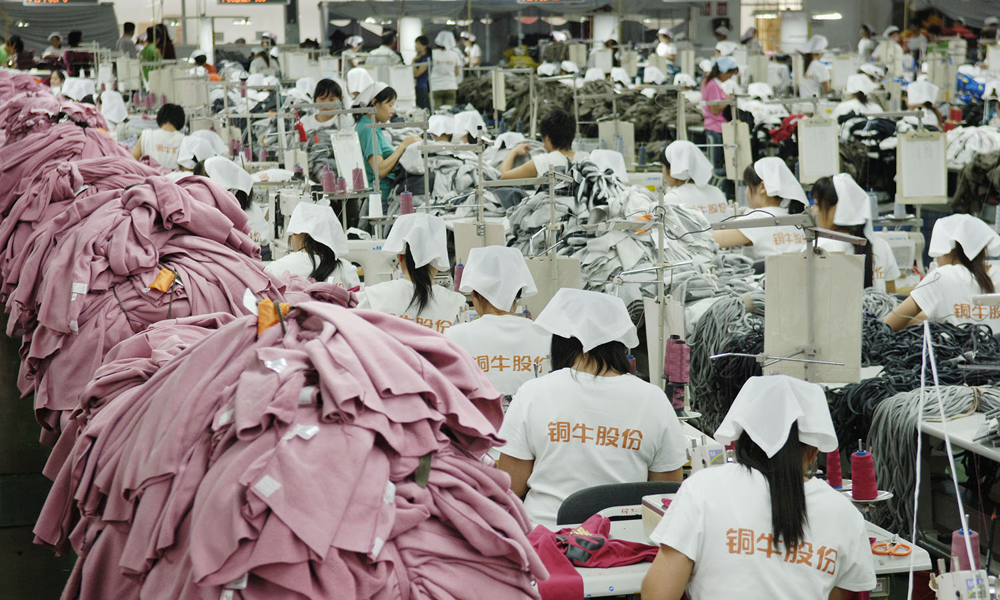
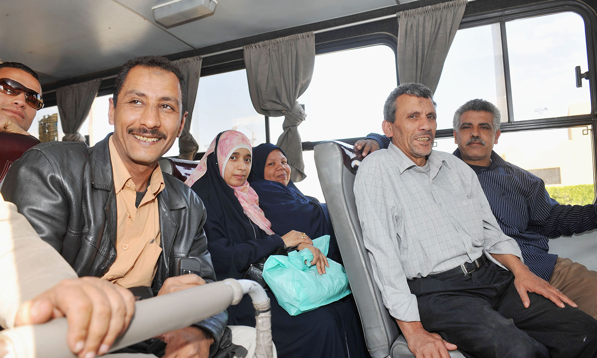

## Orario di lavoro nell’industria 1919

Fissazione dell’orario di lavoro in 8 ore giornaliere e 48 ore settimanali.

---

## Protezione della maternità 1919

Diritto a congedo per maternità nelle sei settimane successive al parto e alle prestazioni mediche necessarie. La lavoratrice ha diritto a due ore di permesso dal lavoro nel periodo dell’allattamento. Le integrazioni introdotte dalla Convenzione del 1952 (n. 103) e dalla Convenzione del 2000 (n. 183) estendono la durata minima del congedo retribuito, introducono il diritto a non effettuare lavori pericolosi e fissano i costi del congedo a carico della sicurezza sociale o tassazione generale. 
La Convenzione n. 3 è stata ratificata da 34 Stati membri. L’Italia ha ratificato la Convenzione nel 1952.

---

## Riposo settimanale nell’industria 1921

Il personale occupato in ogni stabilimento industriale, pubblico o privato, o nelle sue dipendenze, deve godere di una giornata di riposo settimanale.

La Convenzione è stata ratificata da 120 Stati membri. L’Italia ha ratificato nel 1924

---

## Congedo retribuito 1936

Ogni lavoratore ha il diritto alle ferie retribuite. 

La Convenzione è stata ratificata da 54 Stati membri. L’Italia ha ratificato la Convenzione nel 1952 ma non è attualmente in vigore.

---

## Sviluppo delle risorse umane 1975

Sviluppo di politiche e programmi di orientamento e formazione professionale per tutti i lavoratori, volti al miglioramento della capacità dell’individuo.

La Convenzione è stata ratificata da 68 Stati membri. L’Italia ha ratificato la Convenzione nel 1979.

---

## Lavoratori con responsabilità familiari 1981

I lavoratori con responsabilità famigliari, in relazione ai figli a carico o altri componenti della famiglia, devono poter esercitare i propri diritti senza essere discriminati e senza conflitto tra vita professionale e famigliare. 

La Convenzione è stata ratificata da 44 Stati membri. L’Italia non ha ratificato la Convenzione.

---

## Lavoro part-time 1994

I lavoratori part-time devono godere della stessa protezione dei lavoratori a tempo pieno, relativamente a: libertà di associazione e negoziazione collettiva, salute e sicurezza sul lavoro, discriminazioni sul lavoro. 

La Convenzione è stata ratificata da 17 Stati membri. L’Italia ha ratificato la Convenzione nel 2000.

---

## Lavoro a domicilio 1996

Parità di trattamento tra lavoratori a domicilio e gli altri lavoratori dipendenti in relazione a: libertà di associazione e negoziazione collettiva; salute e sicurezza sul lavoro, discriminazione sul lavoro.

La Convenzione è stata ratificata da 10 Stati membri. L’Italia non ha ratificato la Convenzione.

---

## Lavoratori domestici 2011

Protezione e la promozione dei diritti umani di tutti i lavoratori domestici, in particolare: libertà di associazione e negoziazione collettiva; salute e sicurezza sul lavoro, discriminazione sul lavoro. 

La Convenzione è stata ratificata da 27 Stati membri. L’Italia ha ratificato la Convenzione nel 2013.

---

## Eliminazione della violenza e delle molestie nel mondo del lavoro 2019

